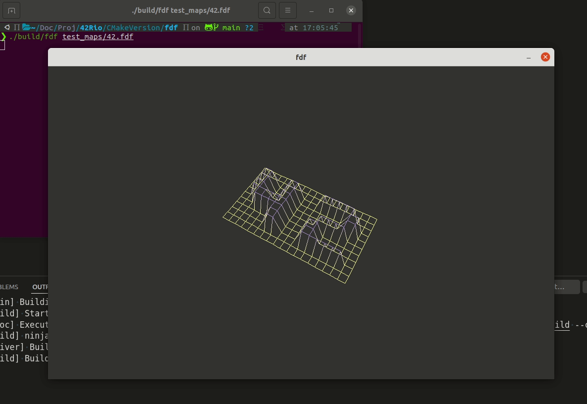

# fdf

Required project of 42's school Level 2. It involves creatin a terrain render using only the mlx and libft as main dependencies.
We added a CMakeLists.txt at the source to allow cross-platform compilation.

The result is the following:



# Compiling

```
cmake -B build
cmake --build build
```

# Usage
```
./build/fdf test_maps/42.fdf
```

